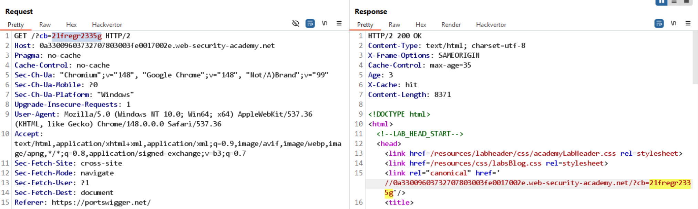
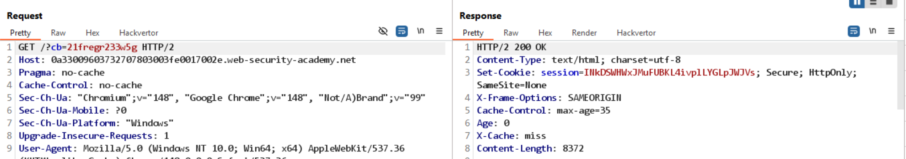
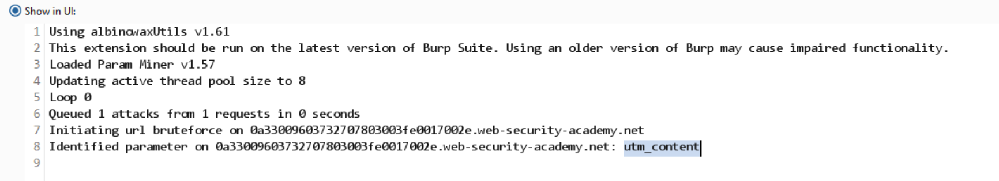

# Lab: Web cache poisoning via an unkeyed query parameter

Web có dùng cache và reflect query parameter vào response header.


Vấn đề: đổi query string nhưng vẫn `cache hit`.


Thử Guess query parameter, tìm được `utm_content`:


Thử send request với `utm_content` có giá trị khác, cache hit vẫn xảy ra
-> tồn tại lỗ hổng cache poisoning qua unkeyed query parameter.

Đoạn code reflect gốc:

```
<link rel="canonical" href='//0a33009603732707803003fe0017002e.web-security-academy.net/?utm_content=21fregr233w5g'/>
```

Bổ sung payload:

```
/?utm_content=randomstring123'/><script>alert(1)</script>
```

-> deliver to victim, Lab solved
