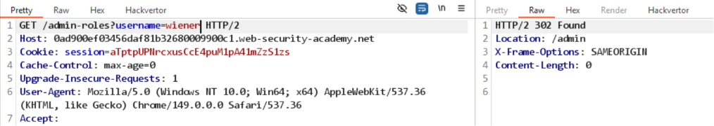

# Lab: Method-based access control can be circumvented

Đăng nhập vào tài khoản `administrator` để học request upgrade và downgrade cho user.
```
POST /admin-roles
Cookie: session=...
...
username=wiener&action=upgrade # hoặc downgrade
```

Khi gửi POST method thì lỗi `Unauthorized`, tuy nhiên nếu chuyển sang GET method thì bypass được, trả về 302:


Bổ sung đầy đủ parameter `action` vào URL và gửi GET request thì thấy lab solve.