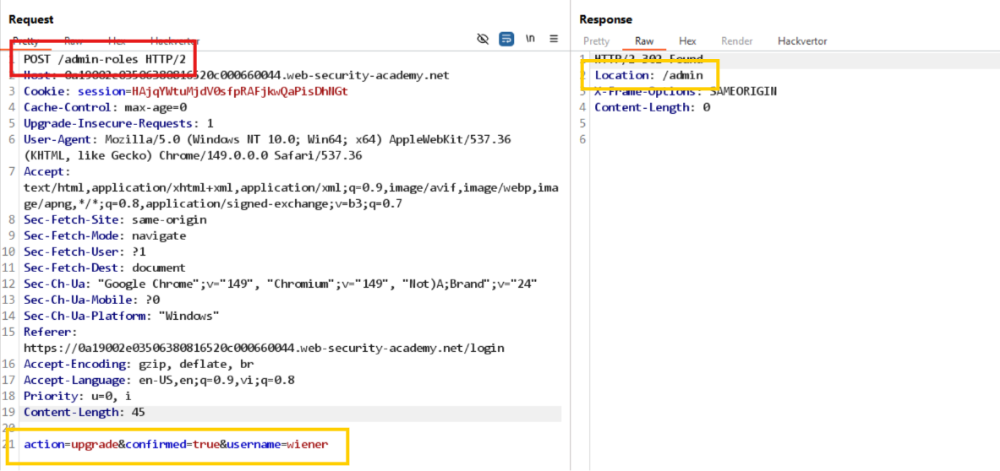

# Lab: Multi-step process with no access control on one step

Truy cập với tài khoản admin, thấy phải xác nhận với `POST /admin-roles` thì mới có thể thật sự sửa role của user. 

Đăng nhập tài khoản wiener, gửi payload duy nhất `POST /admin-roles` thì thấy tự nâng quyền thành công:
