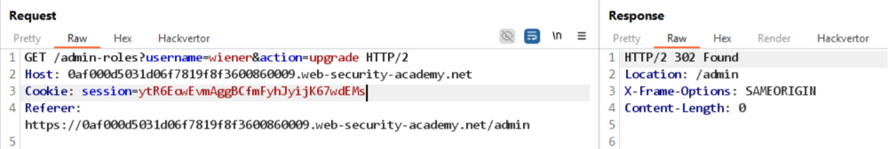

# Referer-based access control

Đăng nhập vào tài khoản administrator, Gửi 2 request sau:
```
# Unauthorized
GET /admin-roles?username=carlos&action=upgrade HTTP/2
Host: 0af000d5031d06f7819f8f3600860009.web-security-academy.net
Cookie: session=8tQj5QE4hN1h5Ep6XycGKKY31tdi5PFs
Referer: https://0af000d5031d06f7819f8f3600860009.web-security-academy.net/

# Success
GET /admin-roles?username=carlos&action=upgrade HTTP/2
Host: 0af000d5031d06f7819f8f3600860009.web-security-academy.net
Cookie: session=8tQj5QE4hN1h5Ep6XycGKKY31tdi5PFs
Referer: https://0af000d5031d06f7819f8f3600860009.web-security-academy.net/admin
```

Reference khác nhau cho ra 2 kết quả khác nhau, thử tự nâng quyền bằng cách thêm header `Referer` vào request:
