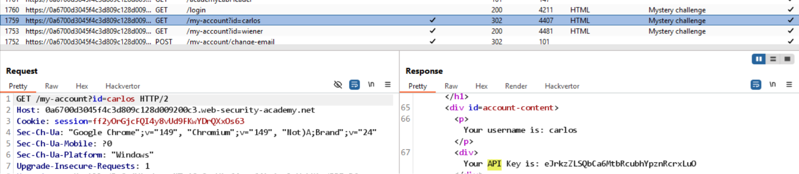

# Lab: User ID controlled by request parameter with data leakage in redirect

Khi đăng nhập và đổi đường dẫn thành `/my-account?id=carlos` thì bị redirect về `login`. tuy nhiên, trên Burp có bắt được 1 request `GET /my-account?id=carlos` chứa API Key của Carlos. 

