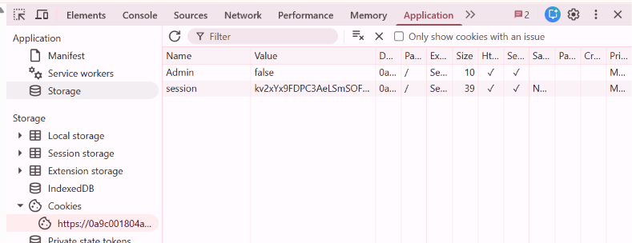

# Lab: User role controlled by request parameter

Đăng nhập vào ứng dụng với tư cách là người dùng bình thường (`wiener:peter`).

Thấy có cookie mang giá trị `Admin:false`.

Sửa lại thành `true` và reload lại trang sẽ truy cập được admin panel để xóa user `carlos`.
