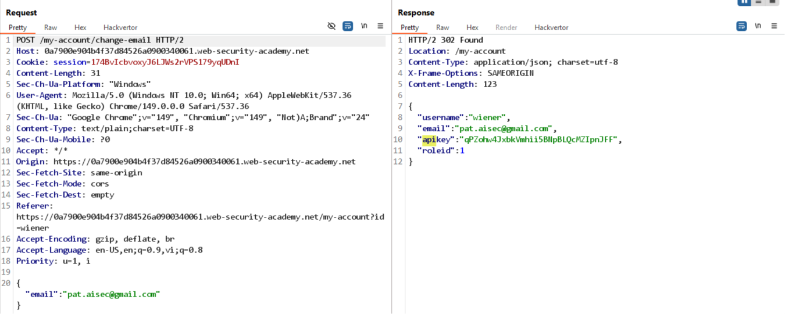

# Lab: User role can be modified in user profile

Khi đổi email, thấy response có chứa `roleid` đáng ngờ:

Thử sửa payload thành `roleid=2` và gửi request, sau đó reload lại page, thấy có thể truy cập vào admin panel.

Xoáy user carlos để solve lab. 