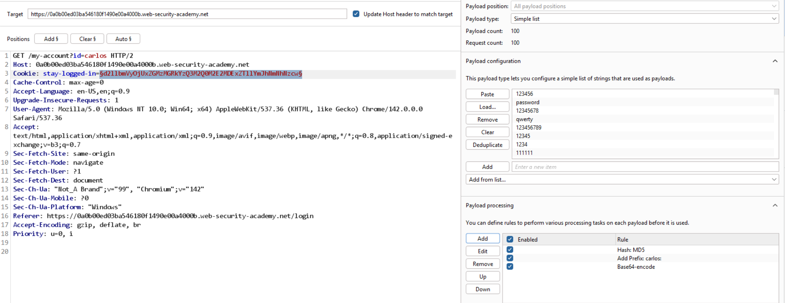

# Lab: Brute-forcing a stay-logged-in cookie

Khi đăng nhập với `stay-logged-in=on`, thấy cookie lưu giá trị `stay-logged-in` dưới dạng:
```
base64(username:md5(password))
```
Tại intruder, add rules lần lượt theo ảnh:


Thu được: `Y2FybG9zOjNiZjExMTRhOTg2YmE4N2VkMjhmYzFiNTg4NGZjMmY4` trả về 200.

-> cred là: `carlos:shadow`