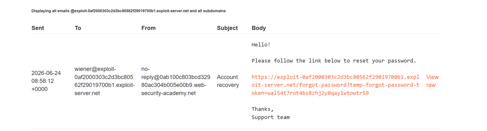

# Lab: Password reset poisoning via middleware

Khi thêm header `X-Forwarded-Host: exploit-0af2000303c2d3bc80562f29019700b1.exploit-server.net` vào request `POST /forgot-password` thì check mail thấy link reset được update:

Gửi để lấy được `temp-forgot-password-token` của carlos, sau đó reset và login với user carlos.