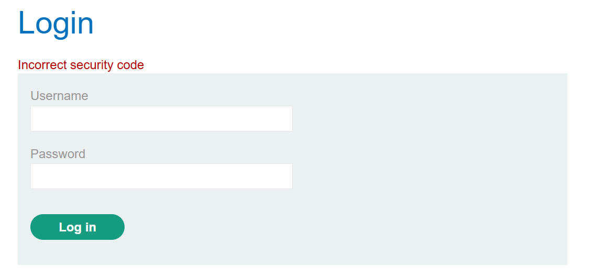

# Lab: 2FA simple bypass

Khi thử đăng nhập với username `wiener` và password `peter`, ta thấy có thông báo yêu cầu nhập mã 2FA. Khi nhập sai mã 2FA 1 lần, tự động bị điều hướng về trang đăng nhập và hiện thông báo `Incorrect security code`:

Thử bỏ qua bước 2FA bằng cách sửa url thành `/my-account?id=carlos`, thấy truy cập được vào trang của user `carlos` mà không cần nhập mã 2FA -> lab solved.
