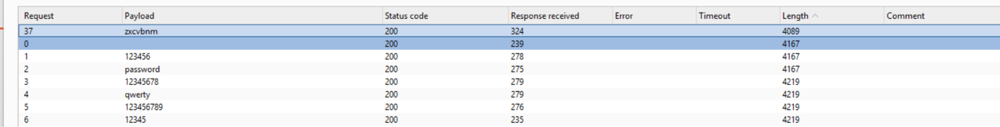

# Lab: Username enumeration via account lock

Thử bruta-force username list với password được cấp thì thấy riêng username `ai` trả về lỗi `account locked`, còn các username khác trả về `invalid username or password`. Điều này chứng tỏ username `ai` tồn tại và đã bị khóa.

sau đó set `username=ai` và brute-force password với wordlist được cấp, thấy có 1 password trả về length khác biệt:

thử lại với password đấy.