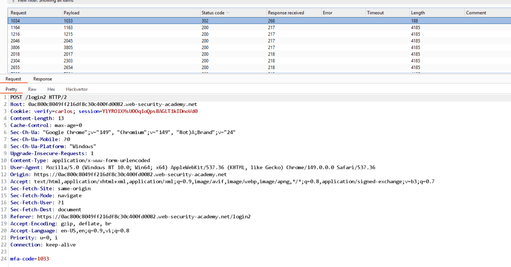

# Lab: 2FA broken logic

Khi gửi lại request:
```
GET /login2 HTTP/2
Host: 0ac800c8049ff216df8c30c400fd0082.web-security-academy.net
Cookie: verify=wiener; session=ToWzQMC8yrZ5Q84jMXzYB1Ezug0cQ80L
```

Thấy gmail nhận được mfa-code

Ngoài ra, web không có cơ chế kiểm soát số lần nhập mfa-code, nên có thể brute-force mfa-code.



Đăng nhập vào tài khoản `carlos` với mfa-code `1033` để hoàn thành lab.