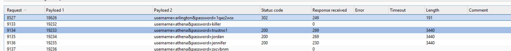
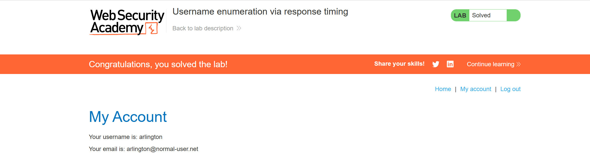

# Lab: Username enumeration via response timing

Khi thử `POST /login` nhiều thì thấy nó bị lỗi `You have made too many incorrect login attempts. Please try again in 30 minute(s).`, nhưng khi thêm header `X-Forwarded-For` với giá trị khác nhau thì có thể thử nhiều lần mà không bị lỗi.

Send request to intruder, chạy lệnh gen để sinh được file payload ném vào intruder (dù cách này hơi ngu và mất tgian):

```
username=arlington&password=1qaz2wsx
```

Đăng nhập để solve thôi:
